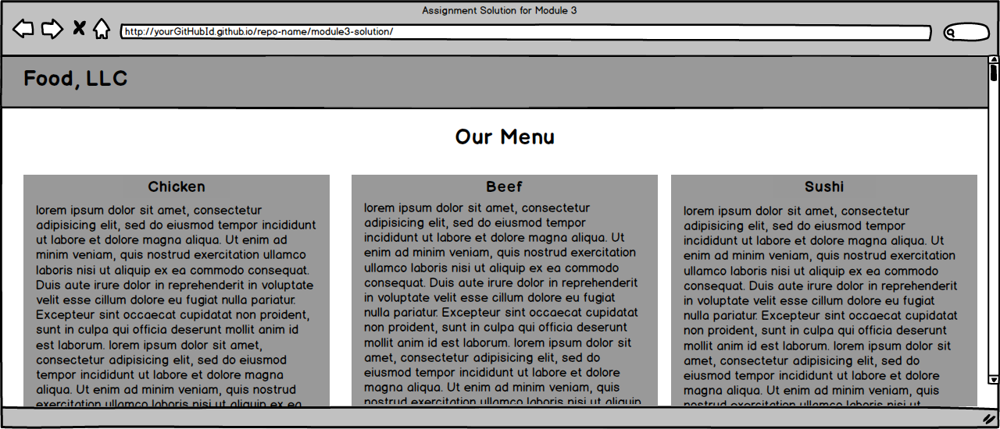
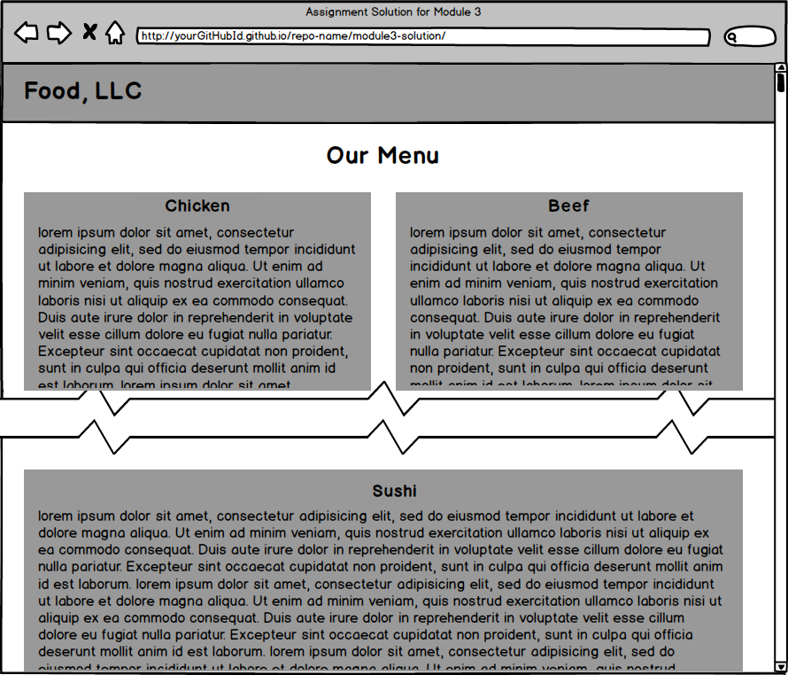

# module3-solution

## Description

It is an assignment in the course "HTML, CSS, and Javascript for Web Developers" by Johns Hopkins University in partnership with Coursera.

**the required**: 

OPTIONAL, UNGRADED PORTION IS BELOW:

The rest of this assignment is not graded and is optional, but it's good practice, so go for it if you have time. The solution to the optional ungraded portion of the assignment below does NOT have to be submitted.

1. (OPTIONAL, NOT GRADED) Since in this optional part you will be implementing something more complex than a single section in the Bootstrap grid, remove that section before continuing.

2. (OPTIONAL, NOT GRADED) the rest of your site is very simple. It consists of a page heading and 3 sections (all in one row in the desktop view). Each section contains some text. You can make it dummy text/"lorem ipsum", it doesn't matter. How the sections are laid out on the screen depends on the width of the browser window. (Hint: use the Bootstrap Grid)

3. (OPTIONAL, NOT GRADED) Each section should be fairly large in height. You can achieve this by either filling it up with a lot of content text or simply setting its height property to something large like 700px. At the end of each section, provide a link that says "Back to Top". This link should jump the page back to the "Our Menu" heading.

4. (OPTIONAL, NOT GRADED) Each section should have an h3-based section heading which should be centered within the section. Use the same Bootstrap class you used for centering the page heading to center the section heading. Use the heading names shown in the mockup illustrations, i.e., "Chicken", "Beef", "Sushi".

5. (OPTIONAL, NOT GRADED)Layout: In the desktop view, each of the 3 sections should take up an equal amount of space on the screen. As you make the browser window wider or narrower, each section should become wider or narrower.

For a visual reference of this view, see the desktop mockup illustration below.

6. (OPTIONAL, NOT GRADED)Layout: In the tablet view, the first 2 sections should be in the first row and be of equal size. The 3rd section should be in the second row and take up the entire row by itself.

For a visual reference of this view, see the tablet mockup illustration below.

7. (OPTIONAL, NOT GRADED)Layout: In the mobile view, each section should take up the entire row.

For a visual reference of this view, see the mobile mockup illustration below.

8. (OPTIONAL, NOT GRADED) Link the menu items "Chicken", "Beef", "Sushi" from the mobile-only menu drop down to jump to the part of the page those sections correspond to.

MOCKUP ILLUSTRATIONS ARE BELOW:

Please NOTE: these mockup illustrations show parts that are optional and not graded for this assignment. Please refer to the requirements above to confirm what parts of the mockup are required and graded and what parts are optional.

Here is the mockup illustration of the desktop version of the site: 

Here is the mockup illustration of the tablet version of the site:   

Here is the mockup illustration of the mobile version of the site with the menu dropdown NOT open (on the left) and menu drop down open (on the right):

## development
* Haitham Elsherbiny